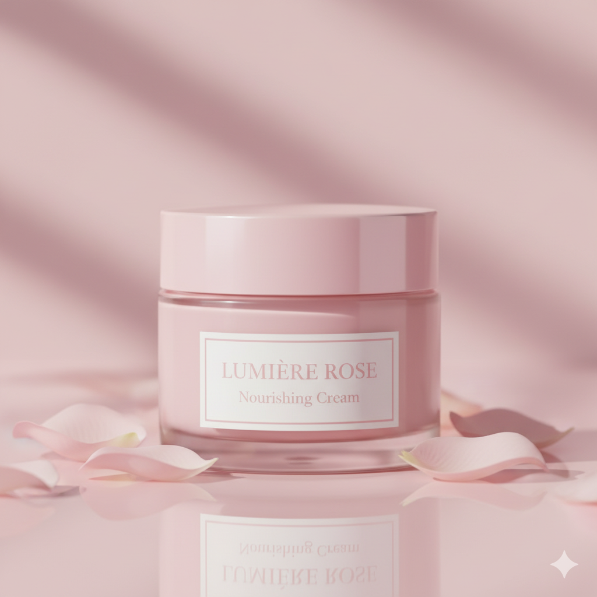

# krrCare


Welcome to **krrCare**! This project is a web application for showcasing products with a modern UI.

## Repository

GitHub: [Aswinsaipalakonda/krrCare](https://github.com/Aswinsaipalakonda/krrCare)


## Features

- 🛒 Product Gallery
- 🔍 Search Functionality
- 📱 Responsive Design
- 🎨 Custom Styles

## Project Structure

```
├── index.html         # Main HTML file
├── script.js          # JavaScript logic
├── style.css          # Stylesheet
├── images/
│   └── products/      # Product images & logo
```

## Getting Started

1. Clone the repository:
	```powershell
	git clone https://github.com/Aswinsaipalakonda/krrCare.git
	```
2. Navigate to the project folder:
	```powershell
	cd krrCare
	```
3. Open `index.html` in your browser to view the site.


## Deploying the Site

You can deploy this site using GitHub Pages or Vecel


## Screenshots



## Technologies Used

- HTML5
- CSS3
- JavaScript

## Author

- 👤 Aswin Sai Palakonda - Made with ❤️

## License

This project is licensed under the MIT License.
